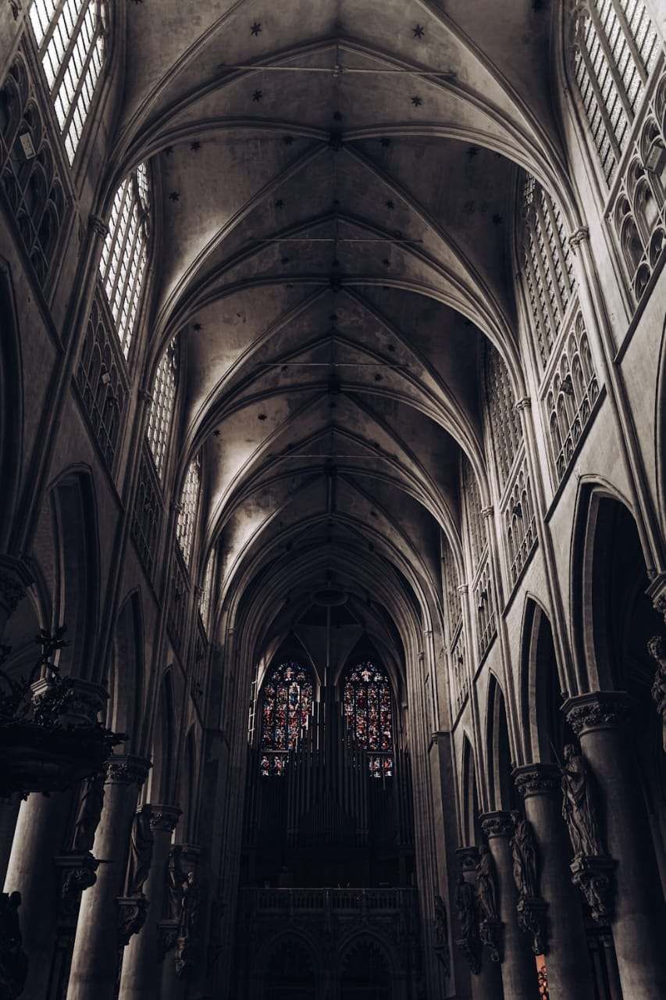

<!DOCTYPE html>
<html lang="en">
<head>
    <meta charset="UTF-8">
    <meta name="viewport" content="width=device-width, initial-scale=1.0">
    <link href="https://fonts.cdnfonts.com/css/lavoza" rel="stylesheet">
    <!-- Other head elements -->
    <title>Meretricious Musing</title>
    <link rel="stylesheet" type="text/css" href="style.css">
    
</head>
<body>
    <header class="header">
        

            
            Meretricious Musings
        

        <nav class="navbar">
            
            

                <button class="dropbtn">Menu 
                    <i class="fa fa-caret-down"></i>
                </button>
                

                   <a href="#">Home</a>
            <a href="submit.html">Submit Work</a>
            <a href="#">Poetry</a>
            <a href="#">Short Stories</a>
            <a href="#">Art</a>
            <a href="#">Essays</a>
            <a href="#">Photography</a>
            <a href="#">Issues</a>
            <a href="#">Blog</a>
             <a href="#">FAQ</a>

                

            
 
        </nav>
    </header>

    <main class="main">
        

            
            

                <h1>Meretricious Musings</h1>
                
Literary Journal

            

        

        <h2>About Us</h2>
        

        
At Meretricious Musings, we believe that every voice matters. Our platform is dedicated to amplifying the creative expressions of young writers, particularly those who are passionate about mental health awareness. We recognize the power of storytelling, poetry, and art in addressing and destigmatizing mental health issues. Whether you’re an aspiring poet, a budding artist, or a storyteller with a unique perspective, we’re here to celebrate your work. We provide a supportive community where your voice can be heard, your ideas can flourish, and your creative endeavors can find an appreciative audience. At Meretricious Musings, we strive to foster an environment where young creatives feel empowered to share their stories and make a meaningful impact on the conversation around mental health. Our commitment is to create a space where your contributions are valued and your journey as a writer or artist is nurtured. Join us, and become part of a community that champions creativity, expression, and mental health awareness.

        
        

            <h1>Subscribe</h1>
            
We are excited to announce that we are now accepting submissions for our inaugural issue. To stay informed about updates, exciting news, and the final release of our magazine, please fill out the form below to join our mailing list. For additional content and updates, follow us on social media using the links provided. If you have any questions or concerns, don't hesitate to reach out to us.

            <form action="/submit" method="post">
                <label for="email">Enter your email here *</label> 
                <input type="email" id="email" name="email" required>  
                <button type="submit">Sign Up</button>
            </form>
        

        

            

                <i class="fas fa-envelope"></i>
                <h3>Email</h3>
                <a href="mailto:alexishassan999@gmail.com">alexishassan999@gmail.com</a>
            

            

                <i class="fab fa-instagram"></i>
                <h3>Instagram</h3>
                <a href="https://www.instagram.com/mereticious">@mereticious</a>
            

            

                <i class="fab fa-tiktok"></i>
                <h3>Tiktok</h3>
            <a href="https://www.tiktok.com/@meretricious_musings">@meretricious_musings</a>
            

            
                
